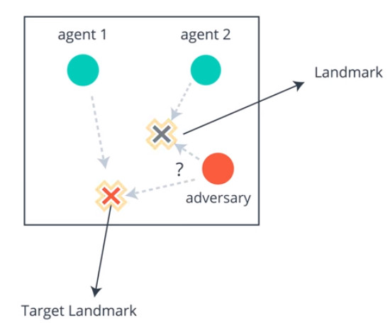

# physical-deception
This repository contains an implementation of Multi-Agent Deep Deterministic Policy Gradient in PyTorch to solve the Physical Deception environment from OpenAI.
This source was copied from Udacity course on Deep Reinforcement Learning Nanodegree.

## Environment
There are 2 green agents, one red agent, one target landmark, and one fake landmark. 
The target of all agents are to be as close as possible to the target landmark.
However, green agents knows which landmark is targeted but the red or adversary is color-blind.
The optimal solution is for the green agents to split up to the two target, and the red agent should follow one of the green agent.
Whenever, a positive reward here is function of the distance between the green agents and the target landmark wherease
a negative reward is received proportionally to the distance between the red agent and the target landmark.



## Content of this repository
* main.py: run this to train the model. Be sure to increase the number of parallel agents to the number of cores your computer have in main.py
* maddpg.py: implementation of the Multi-Agent Deep Deterministic Policy Gradient
* clean.sh: to delete the logs before the training
* run_tensorboard.sh: to visualize the progress of the training
## Requirements
To run the codes, follow the next steps:
* Create a new environment:
	* __Linux__ or __Mac__: 
	```bash
	conda create --name maddpg python=3.6
	source activate ddpg
	```
	* __Windows__: 
	```bash
	conda create --name maddpg python=3.6 
	activate ddpg
	```
* Install Tensorflow and Tensorboard
    ```bash
    pip install tensorflow, tensorflow-gpu
    ``` 
    or 
    ```bash
    pip install tensorflow
    ``` 
* Install OpenAI Baseline by following this [instruction](https://github.com/openai/baselines) (use this commit hash: 98257ef8c9bd23a24a330731ae54ed086d9ce4a7).
The following guidance are helpful in a Windows environment:
    * This link may help on how to revert to a specific commit using [TortoiseGit](https://stackoverflow.com/questions/46690334/how-to-revert-a-particular-commit-using-tortoisegit).
    * Some exception related to the compiling of atary-py and mucojo-py may arise, just ignore them. The next instructions are clues that may help to fix them
        * [Make](http://gnuwin32.sourceforge.net/packages/make.htm) needs to be available also on Windows PATH
        * [zlib](http://gnuwin32.sourceforge.net/packages/zlib.htm) is needed to compile atari-py and should be added on Windows PATH
        * The following packages are required to compile mucojo-py
        ```bash
        pip install cffi, cython, lockfile
        ```
* Install [pytorch](http://pytorch.org/)
```bash
conda install pytorch -c pytorch
```
* Install [Tensorboard-Pytorch](https://github.com/lanpa/tensorboard-pytorch)
```bash
pip install tensorboardX
```
* Install [OpenAI Gym](https://github.com/openai/gym)
```bash
pip install gym
```
* Install these other packages
```bash
pip install imageio, cloudpickle, progressbar
```